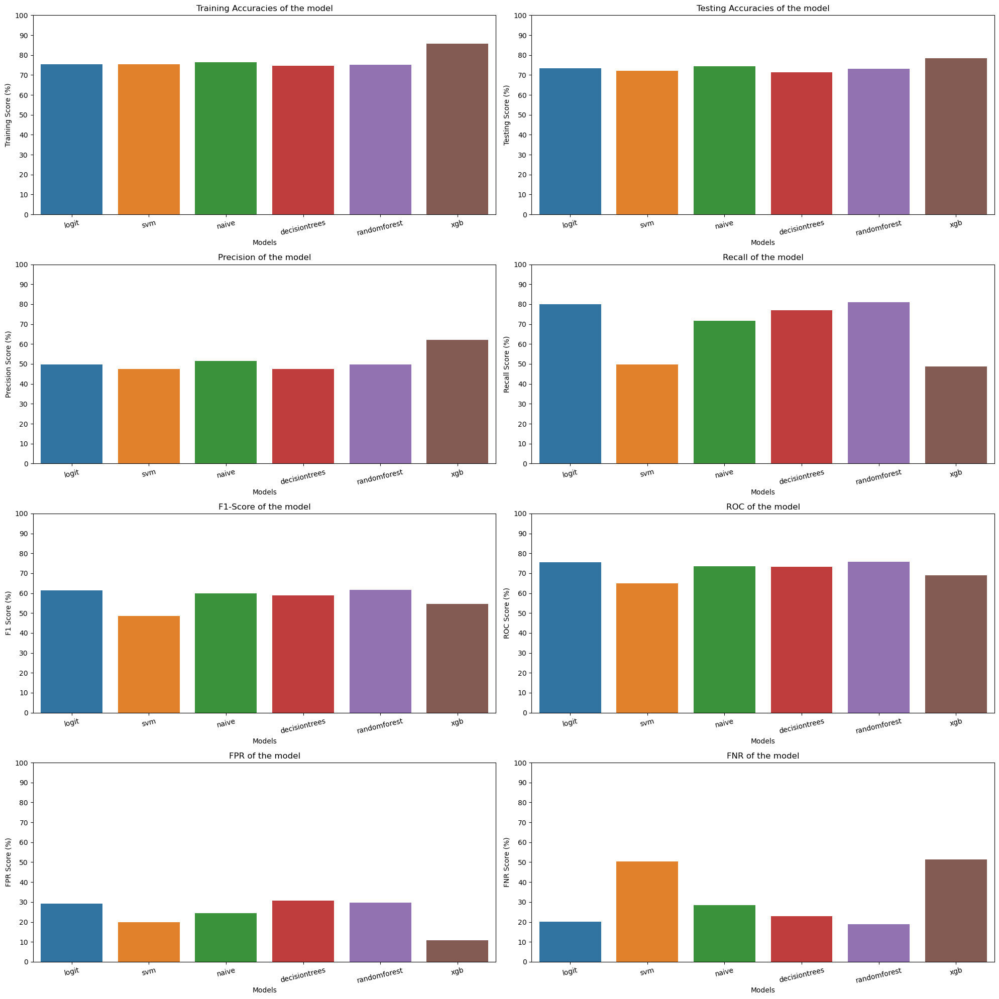

# 📊 Customer Churn Prediction — MLOps Project
---

## 📌 Introduction

Customer churn is one of the most critical challenges facing businesses today. Retaining existing customers is significantly more cost-effective than acquiring new ones, making accurate churn prediction an invaluable business tool.

This project delivers an end-to-end **MLOps-based Customer Churn Prediction system** — combining machine learning, a production-grade REST API, and an interactive web interface — all containerized and ready to deploy.

---

## 🚀 Project Overview

The system is designed to simulate a real-world production ML pipeline where a trained model is exposed via a FastAPI backend and consumed by a Streamlit frontend, with the entire stack orchestrated using Docker Compose.

## 🌐 Live Demo

👉 **[Try the app here](https://customerchurn944.streamlit.app/)**

The application is live and hosted on Streamlit Cloud. No installation required — just open the link and start predicting!
---

## 📁 Project Structure

```
customer-churn-prediction/
│
├── app/                              # Streamlit Frontend
│   ├── app.py                        # Main Streamlit application
│   └── streamlitrequirements.txt     # Frontend dependencies
│
├── churn_fastapi/                    # FastAPI Backend
│   ├── main.py                       # Prediction API endpoints
│   ├── churnpredictor.pkl            # Trained ML model
│   └── fastrequirements.txt          # Backend dependencies
│
├── datasets/                         # Data files
│   ├── churnData.csv                 # Raw dataset
│   ├── cleaned.csv                   # Cleaned dataset
│   ├── formodel.csv                  # Processed dataset for training
│   └── modelperformance.csv          # Model evaluation results
│
├── EDA/                              # Exploratory Data Analysis
│   └── eda.ipynb                     # Data analysis and visualization
│
├── Model Preparation/                # Model development pipeline
│   ├── featureengineering.ipynb      # Feature engineering steps
│   └── model.ipynb                   # Model training and evaluation
│
├── Docker-compose.yml                # Multi-container Docker orchestration
├── Dockerfile.churnstreamlit         # Dockerfile for Streamlit frontend
└── Dockerfile.fastapi                # Dockerfile for FastAPI backend
```

---

## 🤖 Machine Learning Model Performance

| Model               | Precision | Recall | F1-Score |
|---------------------|-----------|--------|----------|
| Logistic Regression | 49.83%    | 79.94% | 61.39%   |
| Linear SVM          | 47.57%    | 49.73% | 48.63%   |
| Naive Bayes         | 51.44%    | 71.66% | 59.89%   |
| Decision Tree       | 50.18%    | 75.67% | 60.34%   |
| **Random Forest**   | **49.75%**| **81.02%** | **61.65%** |
| XGBoost             | 62.12%    | 48.66% | 54.57%   |

## Detailed overview of the metrics used to select the best model.


> ✅ **Random Forest** was selected as the production model based on its highest F1-Score and Recall — minimizing missed churn cases is the business priority.

## 🎯 Threshold Optimization Strategy

In churn prediction, **False Negatives are the most costly error** — a customer predicted as "not churning" who actually does churn means losing them with no intervention.

To address this, rather than using the default 0.5 probability threshold, the model's predicted probabilities were evaluated across a range of thresholds. For each threshold, the following metrics were tracked:

| Metric | Description |
|--------|-------------|
| Recall | % of actual churners correctly identified |
| Precision | % of predicted churners who actually churn |
| False Negative Rate (FNR) | % of churners missed by the model |
| False Positive Rate (FPR) | % of non-churners flagged incorrectly |

> 📉 **Lowering the threshold** increases recall and reduces FNR — meaning fewer churners are missed. While this increases false positives, the business trade-off is acceptable: it is far better to offer retention incentives to a non-churner than to miss a customer who was about to leave.

The optimal threshold was selected by maximizing recall while keeping the false negative rate as low as possible.
---

## 🔑 Key Features

- **Churn Prediction** — Predicts customer churn probability using a trained Random Forest model
- **Data Preprocessing** — Handles missing values, encodes categorical features, and scales inputs automatically
- **FastAPI Backend** — High-performance REST API serving real-time predictions with auto-generated docs
- **Streamlit Frontend** — Interactive UI for entering customer data and viewing predictions instantly
- **Dockerized Deployment** — Fully containerized with Docker Compose for consistent, reproducible environments
- **Cloud Deployment** — Backend deployed on Render for live API access

---

## ✅ Prerequisites

Before running this project, make sure you have the following installed:

- [Python 3.12+](https://www.python.org/downloads/)
- [Docker Desktop](https://www.docker.com/products/docker-desktop/)
- [Git](https://git-scm.com/)

---

## 🐳 Running with Docker (Recommended)

**1. Clone the repository**

```bash
git clone https://github.com/your-username/customer-churn-prediction.git
cd customer-churn-prediction
```

**2. Build and start all containers**

```bash
docker compose up --build
```

**3. Access the application**

| Service       | URL                          |
|---------------|------------------------------|
| Streamlit App | http://localhost:8501        |
| FastAPI Docs  | http://localhost:8000/docs   |

**4. Stop all containers**

```bash
docker compose down
```

---

## 🐍 Running Locally (Without Docker)

**1. Clone the repository**

```bash
git clone https://github.com/your-username/customer-churn-prediction.git
cd customer-churn-prediction
```

**2. Install Streamlit dependencies**

```bash
pip install -r app/streamlitrequirements.txt
```

**3. Install FastAPI dependencies**

```bash
pip install -r churn_fastapi/fastrequirements.txt
```

**4. Start the FastAPI backend**

```bash
uvicorn churn_fastapi.main:app --reload
```

**5. Start the Streamlit frontend** (in a new terminal)

```bash
streamlit run app/app.py
```

**6. Access the application**

| Service       | URL                          |
|---------------|------------------------------|
| Streamlit App | http://localhost:8501        |
| FastAPI Docs  | http://localhost:8000/docs   |

---

## 🧠 How the System Works

```
User Input (Streamlit)
       ↓
FastAPI Backend receives request
       ↓
Data is cleaned and preprocessed
       ↓
Random Forest model generates prediction
       ↓
Result returned and displayed in Streamlit
```

1. The user enters customer details through the Streamlit web interface
2. The data is sent as a POST request to the FastAPI backend
3. The backend preprocesses the input and runs it through the trained model
4. A churn prediction (and probability) is returned to the frontend
5. The result is displayed clearly to the user

---

## 🎯 Project Goals

- Build a production-ready machine learning application from scratch
- Implement an end-to-end MLOps pipeline including training, serving, and deployment
- Containerize the full stack using Docker and Docker Compose
- Apply real-world data science practices to solve a business problem

---

## 📬 Contact

Have questions or suggestions? Feel free to open an issue or reach out via GitHub.
